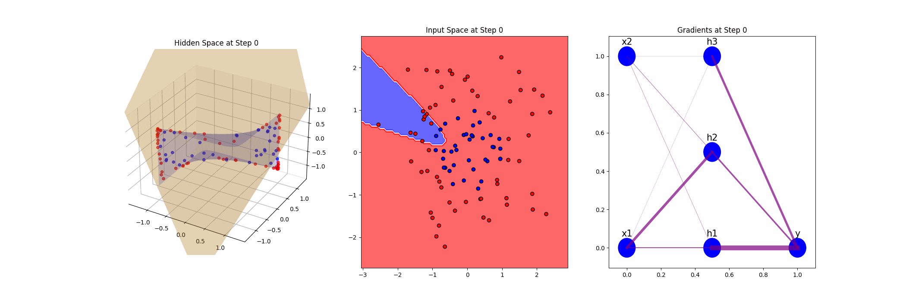

# Neural Networks — From Scratch

This project implements and analyzes a simple feedforward neural network from scratch, with custom visualizations of learned features, decision boundaries, and gradients. The goal is to better understand how a feedforward neural network with one hidden layer learns to represent input space during training.

---

## Overview

- **Architecture:**  
  - Input layer: 2D features  
  - Hidden layer: 3 neurons, nonlinear activation (ReLU, Sigmoid, or Tanh)  
  - Output layer: single node for binary classification  

- **Dataset:**  
  Randomly generated 2D dataset with two classes separated by a circular decision boundary.  

- **Training:**  
  - Loss: Cross-Entropy  
  - Optimizer: Gradient Descent  

- **Visualization:**  
  - Learned features and decision hyperplane in hidden space  
  - Decision boundary in input space  
  - Gradients, with edge thickness showing gradient magnitude  
  - Animated training process  

---

## Setup

Clone the repository and install dependencies:

```bash
make install
```

This will install all required Python packages from `requirements.txt`, including:

- flask  
- numpy  
- scikit-learn  
- scipy  
- matplotlib  

---

## Usage

### Train & Visualize
Run the core script locally:

```bash
python neural_networks.py
```

Outputs will be saved in the `results/` directory.

### Interactive Web App
Launch the Flask app:

```bash
make run
```

Open your browser at [http://127.0.0.1:3000](http://127.0.0.1:3000), choose parameters, and click **Train and Visualize**.  
The resulting figure will display in-browser (may take a moment to load).

---

## Example Visualization

Here’s an example animation showing the evolution of the decision boundary:



---

## Tech Stack

- Python  
- NumPy, SciPy, scikit-learn  
- Matplotlib  
- Flask  

---

## License

This project is open-source under the MIT License.
